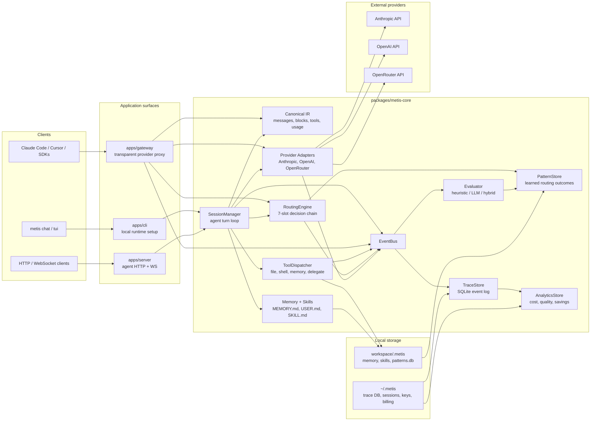

# Metis

A local-first AI dev agent — provider-agnostic, self-improving, and cost-aware.

> **Status:** Phase 1 + Phase 2 + Phase 2.5 + Phase 3 shipped; Wave 16 reaches the GA launch milestone for the first paid cohort. The transparent gateway, multi-user / per-team attribution, evaluator, compliance posture, billing, observability, and launch operations are live enough for buyer trials. The validated routing-surface headline is delegation at **8.3% / 19.9% / 26.1% better cost-per-quality** across three A3 runs. Slot-4 model selection remains a proof-of-mechanism from §A3-rev3; §A3-rev7 completion did not generalize it (zero sonnet picks across 36 routing decisions), so the optional task-domain A3 wedge is deferred post-GA. 1841 tests passing.

> **Launch callout:** Metis is ready for buyer trials as an open-core LLM gateway: Community is free to self-host, Pro is per active user for team controls, and Enterprise reserves a capped savings add-on. The validated routing-surface headline is delegation at **8.3% – 26.1% better cost-per-quality across three runs** (19.9% midpoint in §A3-rev7 completion); model-selection remains an N=1 proof-of-mechanism from §A3-rev3.

---

## Why Metis

Metis optimizes a buyer's LLM bill by composing three levers — context engineering (prompt-cache discipline, lean prompts), skills (focused expert instructions loaded on demand), and routing (delegation plus model selection). The order of typical impact is context > skills > routing. Prompt caching has the cleanest context proof (49/49 cache-fire, 22.8% same-workload cost reduction); delegation has the most reproduced routing proof (8.3% – 26.1% better cost-per-quality across three runs); slot-4 model selection has one end-to-end inversion on `regex-with-edge-cases` and remains a proof-of-mechanism, not a generalized savings regime. See [`docs/savings-demo.md`](docs/savings-demo.md) for the model-selection evidence and [`docs/customer-trial-recipe.md`](docs/customer-trial-recipe.md) for how to reproduce on your own workload.

---

## Quick start

```bash
# Python 3.13 + uv required.
uv sync   # resolves the workspace (metis-core, metis-server, metis-gateway, metis-cli)

# Put your Anthropic API key in a gitignored .env file
echo "ANTHROPIC_API_KEY=sk-ant-..." > .env

# Start a chat in any workspace directory
uv run metis chat . --model sonnet
```

The repo is a uv-workspace monorepo: [`packages/metis-core/`](packages/metis-core/) is the library (canonical types, events, adapters, routing, tools, memory, sessions, pricing, skills, trace); [`apps/server/`](apps/server/), [`apps/gateway/`](apps/gateway/), and [`apps/cli/`](apps/cli/) are the deployable surfaces. The `metis` console-script is shipped by `metis-cli`.

Inside the REPL: type your message and hit return. Slash commands: `/model <alias|id>`, `/model -` (clear sticky), `/cost`, `/models`, `/help`. Ctrl-D or `exit` to leave. Per-message override: start a message with `@haiku` (or any alias) to route that single message to a different model.

Aliases configured out of the box: `opus` / `deep`, `sonnet` / `balanced`, `haiku` / `fast`.

Sanity-check the full loop against the real API in under a minute (~$0.015 with haiku):

```bash
uv run python scripts/smoke.py --model haiku
```

## Try it — first savings number in &lt; 1 hour

The smoothest landing path: kind cluster + helm install + pre-baked
workload + per-key cost rollup, automated end-to-end.

```bash
echo "ANTHROPIC_API_KEY=sk-ant-..." > .env
infra/gateway/scripts/quickstart.sh           # cluster + helm install + first key
source .metis-trial/state.env                 # exports gateway URL + key
uv run metis trial \
    --gateway-url "$METIS_TRIAL_GATEWAY_URL" \
    --gateway-key "$METIS_TRIAL_GATEWAY_KEY"
# → prints `actual / baseline / savings_pct` for the pre-baked workload
infra/gateway/scripts/tear-down.sh            # when done
```

Full step-by-step (curl + Python SDK examples, dashboard view, pitfalls
table) at [`docs/operations/quickstart.md`](docs/operations/quickstart.md).

## Try it — transparent gateway in Docker

Prefer Docker Compose over kind? Same loop, single host:

```bash
cp .env.example .env && $EDITOR .env   # set ANTHROPIC_API_KEY
docker compose run --rm gateway issue-key --name "my-client" --workspace /workspace
docker compose up -d
curl http://127.0.0.1:8422/healthz
```

Full deployment reference (env vars, volumes, key rotation, TLS termination, cost attribution) at [`docs/gateway-deployment.md`](docs/gateway-deployment.md).

## Buyer trial

Once the gateway is up, point your devs' existing tools at it: flip
`ANTHROPIC_BASE_URL` (Claude Code) or `OPENAI_BASE_URL` (Cursor, openai-python)
to the gateway URL, hand over a `gw_…` key, and every turn is cost-stamped per
dev, per project — no client code changes. End-to-end recipe (Claude Code,
Cursor, raw curl/SDK) at [`docs/gateway-client-quickstart.md`](docs/gateway-client-quickstart.md).

> **Gateway exposure:** the gateway defaults to loopback. Non-loopback binds
> are allowed only behind the hardening checklist: TLS termination, rate
> limits, audit logging, and key-leak handling. The layered defenses are
> documented in [`docs/specs/gateway-hardening.md`](docs/specs/gateway-hardening.md).

## Pricing shape

The commercial model is ratified at [`docs/specs/pricing.md §5.5.4`](docs/specs/pricing.md):

| Tier | Model | Included shape |
|---|---|---|
| Community | $0 open-core gateway | Self-hosted gateway and single-user agent surfaces; BYO provider keys |
| Pro | Per active user / month | Multi-user identity, team caps, per-user/team analytics, hosted operations, audit export, LLM judge tier, agent upgrade |
| Enterprise | Custom Pro + capped savings add-on | Outcome-linked contract using the shipped savings counterfactual |

Metis does not resell tokens; provider usage is still billed by Anthropic / OpenAI / OpenRouter. The Wave 15 billing module is Stripe-backed and opt-in via gateway config.

## Sales toolkit

The docs a salesperson reads before a buyer conversation. All sit
under [`docs/sales/`](docs/sales/):

- [`one-pager.md`](docs/sales/one-pager.md) — single-page pitch with the headline numbers, honest caveats, and a deployment-shape grid.
- [`competitive-comparison.md`](docs/sales/competitive-comparison.md) — Metis vs LiteLLM / Portkey / Helicone: canonical-IR fidelity, learned routing, per-user / per-team attribution, where each competitor wins.
- [`objection-handling.md`](docs/sales/objection-handling.md) — common buyer objections (Vercel AI SDK, Cursor / Claude Code, LiteLLM-is-good-enough, unproven-savings, operational-load, SOC2, "are you going to be around") with honest responses.
- [`faq.md`](docs/sales/faq.md) — buyer FAQ: how it works, how it compares, how to evaluate, billing/pricing, what's the savings number, what's the SOC2 story, where data goes, what's next.
- [`case-study-template.md`](docs/sales/case-study-template.md) plus the industry templates (`startup-saas`, `dev-tools-company`, `content-platform`) — slots to be filled by the first GA customer flow; honest framing with reproducible anonymized numbers.

## Operations

The operational docs a buyer's SRE will read before signing. All sit
under [`docs/operations/`](docs/operations/):

- [`quickstart.md`](docs/operations/quickstart.md) — &lt; 1-hour buyer-trial path: kind + helm + `metis trial` end-to-end, with per-key cost rollup and a pitfalls table from validation.
- [`first-customer-runbook.md`](docs/operations/first-customer-runbook.md) — day-0 to day-30 operator cadence for the first paid cohort, including setup call, mid-trial check-in, conversion conversation, and post-conversion onboarding scripts.
- [`billing-operator-guide.md`](docs/operations/billing-operator-guide.md) — Stripe test-mode billing operations: disputes, refunds, failed-payment grace, manual plan changes, and audit-event checks.
- [`launch-day-playbook.md`](docs/operations/launch-day-playbook.md), [`pre-launch-dry-run-checklist.md`](docs/operations/pre-launch-dry-run-checklist.md), and [`support-channels.md`](docs/operations/support-channels.md) — GA day-1 operating rhythm, synthetic-customer dry run, support templates, and SLA expectations.
- [`incident-response.md`](docs/operations/incident-response.md) — SEV1-SEV4 criteria, on-call alert paths (PagerDuty / Opsgenie / email), first-hour playbook, post-mortem template, and per-failure-mode playbooks for upstream LLM outage, trace-DB corruption, gateway-key compromise, and quota runaway.
- [`status-page.md`](docs/operations/status-page.md) + [`status-page-config.yaml`](docs/operations/status-page-config.yaml) — two-tier recipe (external UptimeRobot / Statuspage.io / Better Stack against `/healthz`, plus self-hosted Uptime Kuma in-cluster), paste-ready probe config, publish/redact guidelines, and incident comm templates.
- [`sla-template.md`](docs/operations/sla-template.md) — 99.5% single-region template the buyer can customize for their own downstream-user SLA: service-credit math, exclusions, force-majeure stub (legal-counsel-deferred).
- [`compliance-overview.md`](docs/operations/compliance-overview.md) + [`soc2-readiness.md`](docs/operations/soc2-readiness.md) — one-page buyer-conversation index and the full SOC2 Trust Service Criteria gap audit (Security CC1-CC9, Availability A1, Confidentiality C1, Processing Integrity PI1, Privacy P1-P8) mapped against shipped + buyer-responsibility evidence. Honest about gaps (CC8 change management, third-party pentest, vendor review, SOC2 auditor); Type 1 readiness target Q3 2026 contingent on buyer underwriting the audit cost.

## What it is

Metis is a developer-oriented AI assistant that runs as a small Python server on your localhost, with thin clients (terminal first; desktop and web later). It sits between Claude Desktop (chat) and Cursor (editor-coupled) in scope — a workspace-aware agent that:

- accumulates **skills, memory, and learned task patterns** so it gets more useful over time,
- treats LLM providers as **swappable adapters** so you can change models mid-session without losing state,
- routes each turn through an **explainable, user-overridable** policy chain,
- tracks **cost and behavior** down to the turn so you can see what your agent is actually doing.

## Why

Today's AI dev tools have recurring frictions:

- **Provider lock-in.** Switching tools means rebuilding your context, rules, and history from scratch.
- **No memory across sessions.** You re-explain your codebase, your conventions, and your preferences every time.
- **Opaque model choice.** Either you pay premium prices for routine work, or you fear-cap to a small model and get worse results — with no way to see which would have been right.
- **Auto-routing without trust.** Tools that pick models for you don't show their reasoning. One silent override and the feature gets disabled.
- **Cost is invisible.** Per-turn dollar accounting is rarely surfaced; usage anxiety distorts how people work.
- **Sessions die with the client.** Long-running tasks vanish when the IDE or terminal restarts.
- **Cloud-by-default.** Code, prompts, and traces leave your machine before you opt in.

Metis is built around the inverse of each: portability, persistence, transparency, and local-first by default.

## How it works

Metis has two entry paths sharing one core. The **agent path** owns the full
turn loop: sessions, tools, memory, skills, routing, tracing, evaluation, and
persistence. The **gateway path** is a transparent OpenAI / Anthropic-shaped
proxy for existing clients such as Claude Code, Cursor, and SDK apps.



### Agent path

The agent path is used by `metis chat`, `metis tui`, and `metis serve`.
Metis owns the conversation lifecycle:

1. A client submits a user turn.
2. `SessionManager` persists the user message and assembles context.
3. `RoutingEngine` chooses a model through the seven-slot chain.
4. A provider adapter translates canonical messages into provider wire format.
5. The adapter streams canonical events back to the session manager.
6. If the model requests tools, `ToolDispatcher` executes them inside the
   workspace guardrails and feeds results back into the turn loop.
7. Usage, cost, assistant messages, routing decisions, tool calls, and turn
   boundaries are emitted to the event bus.
8. The trace store, evaluator, pattern store, and analytics layer project from
   that event stream.

This path is where bounded memory, skills, tool execution, prompt-cache
discipline, and planner-worker delegation live.

### Gateway path

The gateway path is used when existing tools point their API base URL at
Metis. It keeps the client's agent loop intact:

1. A client sends `POST /v1/messages` or `POST /v1/chat/completions`.
2. The gateway authenticates the `gw_...` key and checks quotas.
3. The inbound OpenAI or Anthropic-shaped request is translated into canonical
   messages.
4. The router chooses a provider/model, usually honoring the inbound `model`
   field as an explicit per-message override.
5. The selected adapter calls Anthropic, OpenAI, or OpenRouter.
6. The response is translated back into the original provider shape.
7. Trace and cost events are stamped with `gateway_key_id`, inbound shape,
   user, and team.

The gateway deliberately does **not** compose memory, load skills, run tools,
or persist conversations. That boundary is the point: the gateway is the
drop-in adoption path; the full agent is the richer optimization path.

### Core design choices

- **Canonical message format.** One internal representation for messages, content blocks, and tool calls. Provider adapters serialize to and from each provider's wire format. Adding a provider is writing an adapter, not refactoring the system.
- **Seven-slot routing.** Per-message override → manual sticky model → configured yaml rules → learned pattern recommendation → delegate request → workspace default → global default. User intent and policy beat learned behavior; every decision is recorded with a full chain trace.
- **Bounded, portable memory.** `MEMORY.md` (~2 KB) and `USER.md` (~1.5 KB) per workspace, agent-curated. Markdown on disk; edit, version, and sync via git.
- **Skills as portable markdown.** Compatible with the agentskills.io open standard; hand-written, auto-generated, or installed.
- **Event bus + trace store.** Every meaningful action emits a structured event. Analytics, dashboards, and replay all consume the same stream.
- **Cost-aware.** Tokens and USD are tracked per turn/request, attributed to model, gateway key, user/team, and role (planner vs delegated worker). Costs are computed with Decimal math, not provider-rounded floats.
- **Evidence loop.** Evaluator verdicts update pattern outcomes, pattern outcomes can inform future routing, and analytics uses the same trace data as the dashboard and buyer reports.

The deeper design walkthrough lives in [`docs/technical-design.md`](docs/technical-design.md).

## What's working today

- **Three provider adapters.** Anthropic (Opus 4.7, Sonnet 4.6, Haiku 4.5), OpenAI (GPT-5, GPT-5-mini), and OpenRouter (catalog fetched at startup, pricing overlaid). Each implements wire translation, 8-class error classification, bounded retry with `retry_after` honoring, cancellation, per-model `AdapterCapabilities`, and `stream()` returning canonical streaming events. Cross-provider continuity is verified by a real-API smoke test that mid-session switches Anthropic→OpenAI→OpenRouter with tool-use round-trip.
- **Streaming end-to-end.** Adapter `stream()` → `SessionManager` streaming event handler → both CLI live-render and WebSocket clients. Text deltas, tool-use start/input-delta/end, and message-complete events flow through.
- **Five built-in tools + three memory tools.** `read_file`, `write_file`, `patch_file`, `list_dir`, `shell` (all workspace-scoped, `..` and out-of-root symlinks rejected). Plus `memory_add`, `memory_replace`, `memory_consolidate` for bounded memory mutation.
- **Bounded memory.** Per-workspace `MEMORY.md` (~2 KB soft, 4 KB hard) and `USER.md` (~1.5 KB soft, 3 KB hard) under `.metis/`. Soft cap fires `memory.eviction`; hard cap rejects the write so the agent has to consolidate. The agent reads memory fresh from disk on every LLM call (composed into the system prompt). See [`docs/specs/memory-store.md`](docs/specs/memory-store.md).
- **Session manager.** Turn-locked streaming loop, multi-call within a turn, tool cycle wiring, cost stamping, full event emission, parent-event-id chains.
- **Routing engine.** Per-message `@alias` overrides, `/model` sticky, yaml configured rules, pattern-store slot 4, delegation slot 5, capability validation (vision / context-window / tools / system-prompt / structured-output), and per-provider availability tracking. Exactly one `route.decided` event per turn includes the full chain trace.
- **Event bus + SQLite trace store + SQLite session store.** WAL + `synchronous=NORMAL` for sub-millisecond fast-path writes. Replay queries, causal-chain walks, per-session isolation. Messages and sessions persist; restart preserves conversation history.
- **HTTP/WebSocket server.** Starlette + uvicorn ASGI app. REST for sessions/turns/messages/models/health; WebSocket `/sessions/{id}/stream` with single-use attach tokens, snapshot+live replay, filter presets, cancel-via-WS, ping/pong. Loopback-only bind in v1.
- **Three client surfaces.** `metis chat` (line REPL), `metis tui` (Textual app), `metis serve` (HTTP/WS server for external clients). Slash commands `/model`, `/cost`, `/models`, `/help`. Per-message `@alias` syntax.
- **Cost in real time.** Per-turn input/output/cached token costs computed by core (not parroted from provider), `Decimal` math, versioned for retroactive re-pricing. OpenRouter prices overlaid at session start.
- **1841 tests** across canonical round-trips, JSON Schema enforcement, role-content invariants, event catalog, bus dispatch + filtering, workspace escape rejection, dispatcher + confirmation, adapter wire translation + streaming + error classification + retry + cancellation, cross-provider conformance, routing chain + rule loading + predicates + NETWORK-error escalation refinement, memory store + tools, session manager + persistence + streaming, HTTP REST + WebSocket + token registry + confirmations, pattern store v1 + v2 + concurrency hardening, evaluator heuristic + LLM + hybrid + budget + partial-credit primitive, gateway auth + per-key/user/team identity + rate limiting + TLS + bind hardening + self-serve signup + bare-model normalization + auth-failure event emission + `customer_tier` keystore extension, audit log + trace retention + redaction layer + GDPR export/forget, observability metric collector + Prometheus exposition + latency-percentile histograms + dedicated error counters + per-key cost attribution, billing module subscription lifecycle + self-service portal + plan changes + failed-payment grace, webhook idempotency + tier-axis quota composition + Stripe `FakeBillingClient`, `metis customer-report` HTML offline-contract + XSS escaping + JSON determinism + anonymization, `metis trial-status` conversion-readiness bands + threshold pinning.

## What's NOT built yet (next-up)

- **Context-assembler v3 skill activation.** Prompt-cache discipline and minimum-cacheable-prefix padding are live; explicit / agent-side skill activation budgets remain post-GA.
- **Skill curator.** The spec exists, but the implementation is gated on agent-authored skills (`skill_save` + `skill.created(source="auto_generated")`) landing first.
- **Delegation v1 follow-ons.** Async/concurrent workers, cancellation cascade, streaming worker output, recursive delegation, `output_schema`, per-tier timeouts, router-decided delegation, and worker pattern-store integration are deferred.
- **Pattern-store v2 cluster-tightening against real traces.** The synthetic geometry gate passes; a real-embedding / real-API fixture is still a confidence check.
- **§A3 task-domain model-selection wedge.** Math/symbolic, long-context synthesis, and rare API workloads are the next research wedge; deferred post-GA unless buyer evidence reprioritizes it.

See [`docs/KNOWN_ISSUES.md`](docs/KNOWN_ISSUES.md) for spec/impl gaps that are tracked but not yet fixed.

## Roadmap

| Phase   | Target       | Headline deliverable                                                                                              |
|---------|--------------|-------------------------------------------------------------------------------------------------------------------|
| **1**   | weeks 1–4    | Two providers, canonical format, event bus, file/shell tools, basic TUI, manual routing. **CLI prototype done.** |
| **2**   | weeks 5–8    | Hand-written skills, bounded memory, web dashboard, explicit feedback, configured rules.                          |
| **2.5** | weeks 9–10   | Pattern fingerprints, cold-start suggestions, skill auto-generation with security scanner.                        |
| **3**   | weeks 11–14  | Transparent gateway, multi-user attribution, evaluator, compliance / hardening. **Shipped.**                     |
| **4**   | post-GA      | Tauri desktop app, public-ready UX, marketplace foundation, skill curator, delegation follow-ons.                 |

(Calendar time roughly doubles at part-time pace.)

## Documentation

The full documentation site is built from [`docs/`](docs/) with
[mkdocs-material](https://squidfunk.github.io/mkdocs-material/). Four
top-level sections — **Getting Started**, **Specs**, **Operations**,
**Strategy** — with full-text search and per-page GitHub edit links.

```bash
# Local preview (mkdocs-material installed on demand):
uv run --with mkdocs-material mkdocs serve

# Or via Docker (mirrors the gateway shape; serves on 127.0.0.1:8423):
docker compose --profile docs up docs
```

The nav config and theme are in [`mkdocs.yml`](mkdocs.yml); the
container build lives at [`infra/docs/`](infra/docs/). The site is pure
static once built (`mkdocs build` writes to `site/`) so any static host
works for production.

The design is specified before code lands. Start here:

**Project context** (read these first if you're new):

- [AGENTS.md](AGENTS.md) — current state of the codebase, conventions, gotchas. Load-bearing for AI agents.
- [docs/STRATEGY.md](docs/STRATEGY.md) — the *why*: cost-optimization thesis, buyer ≠ user, three cost levers, open strategic questions.
- [docs/project-overview.md](docs/project-overview.md) — vision, principles, architecture, phasing.
- [docs/technical-design.md](docs/technical-design.md) — current architecture, runtime paths, storage model, and design verdict.
- [docs/KNOWN_ISSUES.md](docs/KNOWN_ISSUES.md) — spec/impl gaps tracked from prior reviews; the watchlist of "looks fine but is subtly wrong."

**Component specs** (the contracts):

- [docs/specs/canonical-message-format.md](docs/specs/canonical-message-format.md) — the load-bearing data contract
- [docs/specs/event-bus-and-trace-catalog.md](docs/specs/event-bus-and-trace-catalog.md) — observability spine + closed event-type catalog
- [docs/specs/routing-engine.md](docs/specs/routing-engine.md) — model selection, rules, delegation
- [docs/specs/provider-adapter-contract.md](docs/specs/provider-adapter-contract.md) — adapter interface, wire translation, retry, errors
- [docs/specs/tool-dispatcher.md](docs/specs/tool-dispatcher.md) — tool registry, side-effect classification, confirmation
- [docs/specs/streaming-protocol.md](docs/specs/streaming-protocol.md) — WebSocket protocol for clients
- [docs/specs/server-api.md](docs/specs/server-api.md) — REST endpoints, attach handshake, session lifecycle
- [docs/specs/memory-store.md](docs/specs/memory-store.md) — bounded MEMORY.md / USER.md schema and tools
- [docs/specs/CHANGES.md](docs/specs/CHANGES.md) — cross-spec change log

**Market context:** [docs/market-research/synthesis.md](docs/market-research/synthesis.md) and the four per-stream reports.

## License

_TBD_
