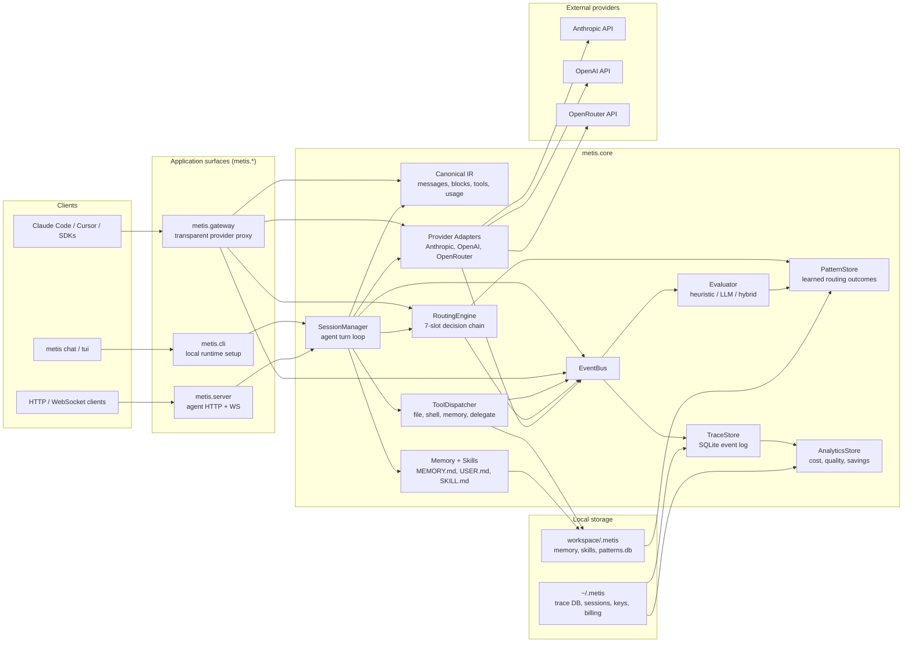

# Metis

**A local-first AI dev agent for your terminal.** Provider-agnostic, cost-aware, and
self-improving. Your codebase stays on your machine; your prompts and traces don't
leave it. Apache-2.0.

<p>
  <a href="LICENSE"></a>
  
  
  
</p>

```text
$ uv run metis chat .
metis> help me debug src/parser.py        # uses your default model (sonnet)
metis> @haiku summarize what you just did # route one turn to a cheaper model
metis> /cost                              # per-turn USD breakdown
metis> /model haiku                       # sticky switch for the rest of the session
```

Switch providers mid-session without losing context. Memory and skills live as
plain Markdown in your workspace — `git diff`-able, portable across machines.
Every turn is cost-stamped in Decimal USD and a full routing-decision trace.

---

## New here? Pick a path

- 🦾 **Just want to chat against an LLM locally?** [Quick start](#quick-start) below — `uv sync` + `uv run metis chat .`. Two minutes to first turn.
- 🧭 **Want the design rationale first?** [Project overview](docs/project-overview.md) — vision, principles, architecture, and the three cost levers.
- 🔌 **Already use Claude Code / Cursor / an SDK?** [Gateway client quickstart](docs/gateway-client-quickstart.md) — point `ANTHROPIC_BASE_URL` / `OPENAI_BASE_URL` at a Metis gateway, no client changes.
- 🏢 **Evaluating for a team?** [First savings number in &lt; 1 hour](docs/operations/quickstart.md) — kind cluster + helm + per-key cost rollup, end-to-end.

---

## Quick start

Two-minute path from clone to first chat. Requires Python 3.13 and [uv](https://docs.astral.sh/uv/).

```bash
git clone https://github.com/david-2814/metis && cd metis
uv sync                                       # resolves the workspace

echo "ANTHROPIC_API_KEY=sk-ant-..." > .env    # or OPENAI_API_KEY / OPENROUTER_API_KEY

uv run metis chat .                           # start chatting in this workspace
```

Inside the REPL: type your message and hit return. Useful commands:

| Command | Effect |
|---|---|
| `@haiku <message>` | Route a single message to a different model (any alias works) |
| `/model <alias\|id>` | Sticky-switch the active model for the rest of the session |
| `/model -` | Clear the sticky model and return to workspace default |
| `/cost` | Per-turn USD breakdown for this session |
| `/models` | List configured models and their aliases |
| `/help` | Full command list |

Aliases out of the box: `opus` / `deep`, `sonnet` / `balanced`, `haiku` / `fast`.
Ctrl-D or `exit` to leave.

Want a TUI instead? `uv run metis tui .` opens the Textual app over the same loop.
Sanity-check the loop against the real API in under a minute (~$0.015 with haiku):
`uv run python scripts/smoke.py --model haiku`.

---

## What you get

- **Provider-agnostic by design.** Anthropic (Opus/Sonnet/Haiku), OpenAI (GPT-5 / GPT-5-mini), OpenRouter — one canonical message format, three adapters. Switch models mid-session and tool-use round-trips just work. Cross-provider continuity is covered by a real-API smoke test.
- **Bounded, portable memory.** `MEMORY.md` (~2 KB) and `USER.md` (~1.5 KB) per workspace, agent-curated as Markdown on disk. Soft cap emits an eviction signal; hard cap rejects the write so the agent has to consolidate. Edit, version, and sync via git.
- **Explainable routing.** Per-message `@alias` → sticky `/model` → workspace yaml rules → learned patterns → workspace default → global default. Every turn emits one `route.decided` event with the full chain trace. No silent overrides.
- **Cost in real time.** Decimal-USD per-turn accounting by model and role (planner vs delegated worker). Versioned pricing for retroactive re-pricing. `/cost` in the REPL; `/analytics/cost` over HTTP.
- **Local-first.** Everything runs on your machine. SQLite trace store + session store under `~/.metis/`. Bounded memory under `<workspace>/.metis/`. The gateway is loopback-only by default; non-loopback binds require the documented hardening checklist.
- **Specs before code.** Component contracts live in [`docs/specs/`](docs/specs/) and ship before the implementation; an integration test suite covers them end-to-end.

The repo is a uv-workspace monorepo with one published package — installed as `metis-llm`, imported as `metis` — at [`packages/metis/`](packages/metis/). It's organized internally into four subpackages: `metis.core` is the library (canonical types, events, adapters, routing, tools, memory, sessions, pricing, skills, trace); `metis.server`, `metis.gateway`, and `metis.cli` are the deployable surfaces. The `metis` console-script ships from `metis.cli`. (The bare `metis` name on PyPI is already taken by an unrelated graph-partitioning library; the install-vs-import name split follows the PyYAML pattern.)

## Try the gateway

Run the transparent OpenAI / Anthropic-shaped proxy on localhost; point
any existing SDK or tool at it without changing client code.

```bash
cp .env.example .env && $EDITOR .env   # set ANTHROPIC_API_KEY
docker compose run --rm gateway issue-key --name "my-client" --workspace /workspace
docker compose up -d
curl http://127.0.0.1:8422/healthz
```

Full deployment reference at [`docs/gateway-deployment.md`](docs/gateway-deployment.md).
For the end-to-end buyer-trial path (kind cluster + helm + pre-baked
workload + per-key cost rollup), see
[`docs/operations/quickstart.md`](docs/operations/quickstart.md).

## Why we built it

Today's AI dev tools have recurring frictions:

- **Provider lock-in.** Switching tools means rebuilding your context, rules, and history from scratch.
- **No memory across sessions.** You re-explain your codebase, your conventions, and your preferences every time.
- **Opaque model choice.** Either you pay premium prices for routine work, or you fear-cap to a small model and get worse results — with no way to see which would have been right.
- **Auto-routing without trust.** Tools that pick models for you don't show their reasoning. One silent override and the feature gets disabled.
- **Cost is invisible.** Per-turn dollar accounting is rarely surfaced; usage anxiety distorts how people work.
- **Sessions die with the client.** Long-running tasks vanish when the IDE or terminal restarts.
- **Cloud-by-default.** Code, prompts, and traces leave your machine before you opt in.

Metis is built around the inverse of each: portability, persistence, transparency, and local-first by default.

## How it works

Metis has two entry paths sharing one core. The **agent path** owns the full
turn loop: sessions, tools, memory, skills, routing, tracing, evaluation, and
persistence. The **gateway path** is a transparent OpenAI / Anthropic-shaped
proxy for existing clients such as Claude Code, Cursor, and SDK apps.

<details>
<summary>Architecture diagram</summary>



</details>

### Agent path

The agent path is used by `metis chat`, `metis tui`, and `metis serve`.
Metis owns the conversation lifecycle:

1. A client submits a user turn.
2. `SessionManager` persists the user message and assembles context.
3. `RoutingEngine` chooses a model through the seven-slot chain.
4. A provider adapter translates canonical messages into provider wire format.
5. The adapter streams canonical events back to the session manager.
6. If the model requests tools, `ToolDispatcher` executes them inside the
   workspace guardrails and feeds results back into the turn loop.
7. Usage, cost, assistant messages, routing decisions, tool calls, and turn
   boundaries are emitted to the event bus.
8. The trace store, evaluator, pattern store, and analytics layer project from
   that event stream.

This path is where bounded memory, skills, tool execution, prompt-cache
discipline, and planner-worker delegation live.

### Gateway path

The gateway path is used when existing tools point their API base URL at
Metis. It keeps the client's agent loop intact:

1. A client sends `POST /v1/messages` or `POST /v1/chat/completions`.
2. The gateway authenticates the `gw_...` key and checks quotas.
3. The inbound OpenAI or Anthropic-shaped request is translated into canonical
   messages.
4. The router chooses a provider/model, usually honoring the inbound `model`
   field as an explicit per-message override.
5. The selected adapter calls Anthropic, OpenAI, or OpenRouter.
6. The response is translated back into the original provider shape.
7. Trace and cost events are stamped with `gateway_key_id`, inbound shape,
   user, and team.

The gateway deliberately does **not** compose memory, load skills, run tools,
or persist conversations. That boundary is the point: the gateway is the
drop-in adoption path; the full agent is the richer optimization path.

### Core design choices

- **Canonical message format.** One internal representation for messages, content blocks, and tool calls. Provider adapters serialize to and from each provider's wire format. Adding a provider is writing an adapter, not refactoring the system.
- **Seven-slot routing.** Per-message override → manual sticky model → configured yaml rules → learned pattern recommendation → delegate request → workspace default → global default. User intent and policy beat learned behavior; every decision is recorded with a full chain trace.
- **Bounded, portable memory.** `MEMORY.md` (~2 KB) and `USER.md` (~1.5 KB) per workspace, agent-curated. Markdown on disk; edit, version, and sync via git.
- **Skills as portable markdown.** Compatible with the agentskills.io open standard; hand-written, auto-generated, or installed.
- **Event bus + trace store.** Every meaningful action emits a structured event. Analytics, dashboards, and replay all consume the same stream.
- **Cost-aware.** Tokens and USD are tracked per turn/request, attributed to model, gateway key, user/team, and role (planner vs delegated worker). Costs are computed with Decimal math, not provider-rounded floats.
- **Evidence loop.** Evaluator verdicts update pattern outcomes, pattern outcomes can inform future routing, and analytics uses the same trace data as the dashboard and buyer reports.

The component contracts live under [`docs/specs/`](docs/specs/).

## Operations

[`docs/operations/`](docs/operations/) holds the playbooks an SRE will
read before signing — quickstart (kind + helm + `metis trial`), incident
response, status-page recipe, SLA template, observability runbook, and
the SOC2 readiness audit.

## Project status

Phase 1 + Phase 2 + Phase 2.5 + Phase 3 shipped. Transparent gateway,
multi-user / per-team attribution, evaluator, compliance posture, billing,
observability, and the operational playbooks are all live.

The validated cost-savings headline is **delegation at 8.3% – 26.1% better
cost-per-quality** (19.9% midpoint) across three independent A3 runs on the
fan-out workload. Slot-4 model selection remains a proof-of-mechanism from
§A3-rev3 — §A3-rev7 didn't generalize it (zero sonnet picks across 36 routing
decisions), so the task-domain wedge is deferred post-GA. See
[`docs/savings-demo.md`](docs/savings-demo.md) for the full evidence and
[`docs/customer-trial-recipe.md`](docs/customer-trial-recipe.md) for the
reproducer.

## What's NOT built yet (next-up)

- **Context-assembler v3 skill activation.** Prompt-cache discipline and minimum-cacheable-prefix padding are live; explicit / agent-side skill activation budgets remain post-GA.
- **Skill curator.** The spec exists, but the implementation is gated on agent-authored skills (`skill_save` + `skill.created(source="auto_generated")`) landing first.
- **Delegation v1 follow-ons.** Async/concurrent workers, cancellation cascade, streaming worker output, recursive delegation, `output_schema`, per-tier timeouts, router-decided delegation, and worker pattern-store integration are deferred.
- **Pattern-store v2 cluster-tightening against real traces.** The synthetic geometry gate passes; a real-embedding / real-API fixture is still a confidence check.
- **§A3 task-domain model-selection wedge.** Math/symbolic, long-context synthesis, and rare API workloads are the next research wedge; deferred post-GA unless buyer evidence reprioritizes it.

See [`docs/KNOWN_ISSUES.md`](docs/KNOWN_ISSUES.md) for spec/impl gaps that are tracked but not yet fixed.

## Roadmap

| Phase   | Status   | Headline deliverable                                                                              |
|---------|----------|---------------------------------------------------------------------------------------------------|
| **1**   | shipped  | Two providers, canonical format, event bus, file/shell tools, basic TUI, manual routing.          |
| **2**   | shipped  | Hand-written skills, bounded memory, web dashboard, explicit feedback, configured rules.          |
| **2.5** | shipped  | Pattern fingerprints, cold-start suggestions, skill auto-generation with security scanner.        |
| **3**   | shipped  | Transparent gateway, multi-user attribution, evaluator, compliance / hardening.                   |
| **4**   | next     | Tauri desktop app, public-ready UX, marketplace foundation, skill curator, delegation follow-ons. |

## Documentation

The full documentation site is built from [`docs/`](docs/) with
[mkdocs-material](https://squidfunk.github.io/mkdocs-material/). Four
top-level sections — **Getting Started**, **Specs**, **Operations**,
**Reference** — with full-text search and per-page GitHub edit links.

```bash
# Local preview (mkdocs-material installed on demand):
uv run --with mkdocs-material mkdocs serve

# Or via Docker (mirrors the gateway shape; serves on 127.0.0.1:8423):
docker compose --profile docs up docs
```

The nav config and theme are in [`mkdocs.yml`](mkdocs.yml); the
container build lives at [`infra/docs/`](infra/docs/). The site is pure
static once built (`mkdocs build` writes to `site/`) so any static host
works for production.

The design is specified before code lands. Start here:

**Project context** (read these first if you're new):

- [AGENTS.md](AGENTS.md) — current state of the codebase, conventions, gotchas. Load-bearing for AI agents.
- [docs/project-overview.md](docs/project-overview.md) — vision, principles, architecture, phasing.
- [docs/KNOWN_ISSUES.md](docs/KNOWN_ISSUES.md) — spec/impl gaps tracked from prior reviews; the watchlist of "looks fine but is subtly wrong."

**Component specs** (the contracts):

- [docs/specs/canonical-message-format.md](docs/specs/canonical-message-format.md) — the load-bearing data contract
- [docs/specs/event-bus-and-trace-catalog.md](docs/specs/event-bus-and-trace-catalog.md) — observability spine + closed event-type catalog
- [docs/specs/routing-engine.md](docs/specs/routing-engine.md) — model selection, rules, delegation
- [docs/specs/provider-adapter-contract.md](docs/specs/provider-adapter-contract.md) — adapter interface, wire translation, retry, errors
- [docs/specs/tool-dispatcher.md](docs/specs/tool-dispatcher.md) — tool registry, side-effect classification, confirmation
- [docs/specs/streaming-protocol.md](docs/specs/streaming-protocol.md) — WebSocket protocol for clients
- [docs/specs/server-api.md](docs/specs/server-api.md) — REST endpoints, attach handshake, session lifecycle
- [docs/specs/memory-store.md](docs/specs/memory-store.md) — bounded MEMORY.md / USER.md schema and tools
- [docs/specs/CHANGES.md](docs/specs/CHANGES.md) — cross-spec change log

**Market context:** [docs/market-research/synthesis.md](docs/market-research/synthesis.md) and the four per-stream reports.

## License

Apache License 2.0 — see [LICENSE](LICENSE) for the full text.

The OSS substrate in this repo is permissively licensed so a CTO doesn't need legal review to install. The paid-tier overlay (`metis-pro`) lives in a separate private repo under a different license; the architectural boundary between the two is exposed through the extension Protocols in [`packages/metis/src/metis/core/extensions.py`](packages/metis/src/metis/core/extensions.py).

Contributions to this repo are accepted under the same Apache-2.0 terms (see [CONTRIBUTING.md](CONTRIBUTING.md)).
