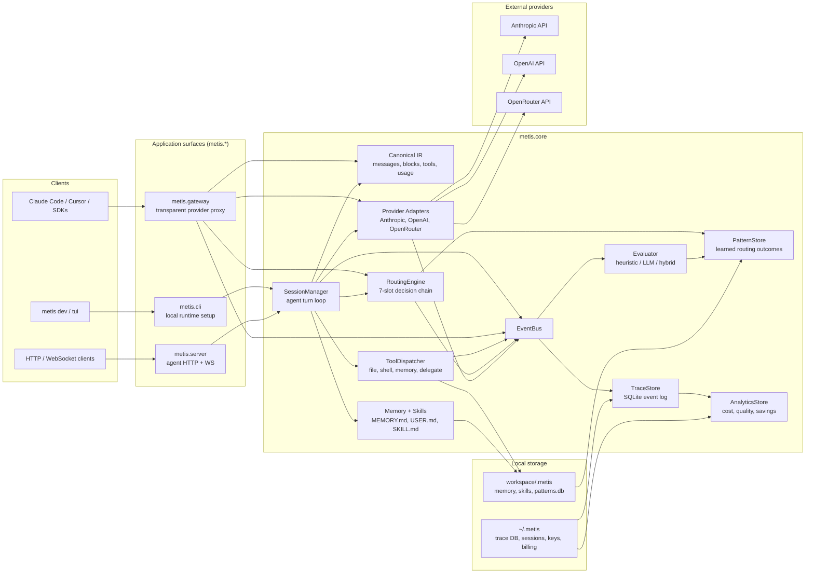
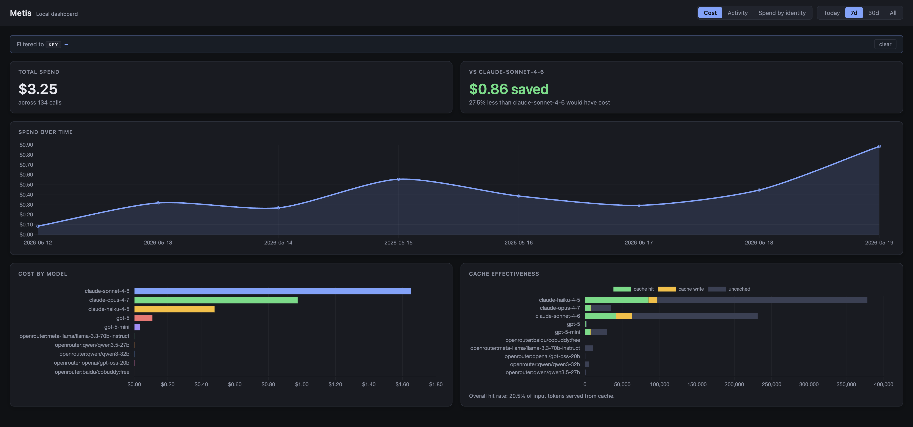
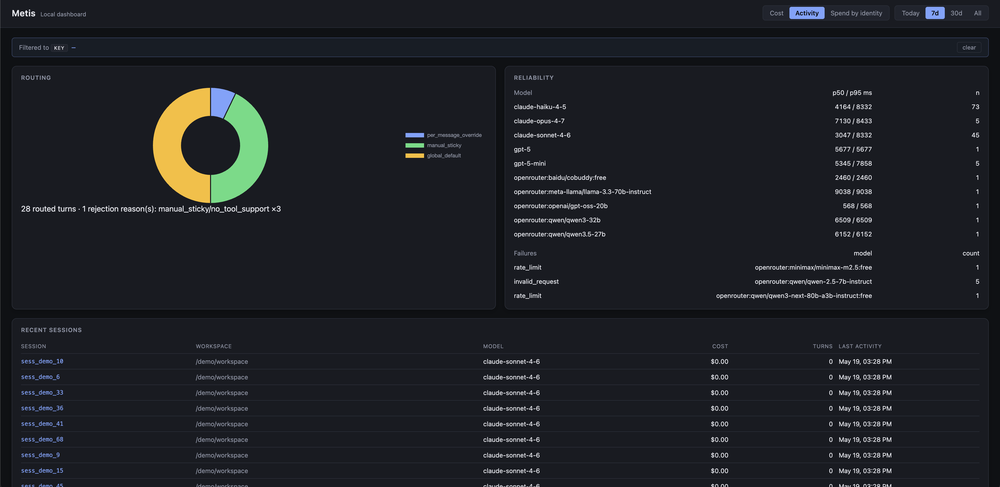
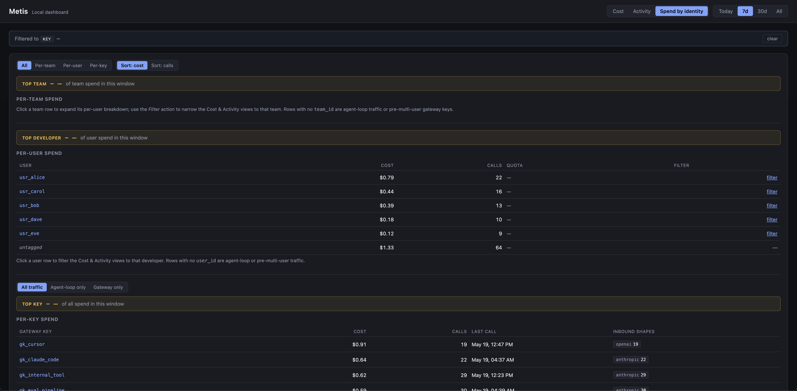

# Metis

**A local-first AI dev agent for your terminal.** Provider-agnostic,
cost-aware, and self-improving. Your codebase stays on your machine; your
prompts and traces don't leave it. Apache-2.0.

<p>
  <a href="LICENSE"></a>
  
  
  
</p>

```text
$ uv run metis dev .
metis> help me debug src/parser.py        # uses your default model (sonnet)
metis> @haiku summarize what you just did # route one turn to a cheaper model
metis> /cost                              # per-turn USD breakdown
metis> /model haiku                       # sticky switch for the rest of the session
```

## What this is

Metis is a local-first AI development agent with two faces: a CLI / TUI
for end-to-end agent sessions, and a transparent OpenAI / Anthropic-shaped
HTTP gateway for existing tools (Claude Code, Cursor, SDKs) to point at.

Both share the same canonical message format, routing engine, event bus,
and cost accounting. Goals:

- **Cost-aware by default.** Every turn is priced in Decimal USD by model
  and role; per-key / per-user / per-team rollups; pinned-baseline
  counterfactuals for "what would single-model have cost?"
- **Provider-agnostic.** Anthropic, OpenAI, OpenRouter — one canonical
  representation, three adapters. Switch providers mid-session without
  losing context.
- **Local-first.** Code, prompts, and traces stay on your machine. SQLite
  trace store under `~/.metis/`; bounded memory under `<workspace>/.metis/`.
  Gateway binds loopback-only by default.
- **Transparent routing.** Seven-slot decision chain (per-message override
  → sticky model → yaml rules → learned patterns → delegate → workspace
  default → global default). Every turn emits a `route.decided` event with
  the full chain trace. No silent overrides.
- **Portable memory.** `MEMORY.md` / `USER.md` per workspace, bounded and
  agent-curated as plain Markdown. `git diff`-able, syncable across
  machines.

## Quick start

Two minutes from clone to first chat. Requires Python 3.13 and
[uv](https://docs.astral.sh/uv/).

```bash
git clone https://github.com/david-2814/metis && cd metis
uv sync                                       # resolves the workspace
```

### Set up an auth token

`metis auth add` walks you through it interactively and validates the key
with a sub-cent ping before persisting to `~/.metis/credentials.yaml`
(mode `0o600`). The key is never echoed.

```bash
uv run metis auth add anthropic               # interactive prompt
# Paste your sk-ant-… key when prompted.
```

Equivalent 12-factor / CI path — drop an env var in `.env` (or export it):

```bash
echo "ANTHROPIC_API_KEY=sk-ant-..." > .env
```

`OPENAI_API_KEY` and `OPENROUTER_API_KEY` work the same way. The resolver
checks `~/.metis/credentials.yaml` first, then env vars. See
[`docs/specs/credentials.md`](docs/specs/credentials.md) for the full
resolution order and `metis auth list / test / doctor` commands.

### Start a session

```bash
uv run metis dev .                            # REPL in this workspace
uv run metis tui .                            # Textual TUI alternative
```

Useful REPL commands:

| Command                 | Effect                                                        |
| ----------------------- | ------------------------------------------------------------- |
| `@haiku <message>`      | Route a single message to a different model (any alias works) |
| `/model <alias\|id>`    | Sticky-switch the active model for the rest of the session    |
| `/model -`              | Clear the sticky model and return to workspace default        |
| `/cost`                 | Per-turn USD breakdown for this session                       |
| `/models`               | List configured models and their aliases                      |
| `/help`                 | Full command list                                             |

Aliases shipped: `opus` / `deep`, `sonnet` / `balanced`, `haiku` / `fast`.
Ctrl-D or `exit` to leave.

### Optional: run the transparent gateway

Point an existing SDK or tool (Claude Code, Cursor, the Anthropic /
OpenAI SDKs) at Metis without changing client code:

```bash
cp .env.example .env && $EDITOR .env          # set ANTHROPIC_API_KEY
docker compose run --rm gateway issue-key --name "my-client" --workspace /workspace
docker compose up -d
curl http://127.0.0.1:8422/healthz
```

Full reference at [`docs/gateway-deployment.md`](docs/gateway-deployment.md);
buyer-trial path (kind + helm + per-key rollup) at
[`docs/operations/quickstart.md`](docs/operations/quickstart.md).

## Architecture

Metis has two entry paths sharing one core. The **agent path** owns the
full turn loop: sessions, tools, memory, skills, routing, tracing,
evaluation, and persistence. The **gateway path** is a transparent
OpenAI / Anthropic-shaped proxy that keeps the client's agent loop
intact.


```mermaid
flowchart LR
  subgraph Clients
    CLI["metis dev / tui"]
    HTTP["HTTP / WebSocket clients"]
    SDK["Claude Code / Cursor / SDKs"]
  end

  subgraph Apps["Application surfaces (metis.*)"]
    CLIApp["metis.cli<br/>local runtime setup"]
    Server["metis.server<br/>agent HTTP + WS"]
    Gateway["metis.gateway<br/>transparent provider proxy"]
  end

  subgraph Core["metis.core"]
    Canonical["Canonical IR<br/>messages, blocks, tools, usage"]
    Sessions["SessionManager<br/>agent turn loop"]
    Routing["RoutingEngine<br/>7-slot decision chain"]
    Tools["ToolDispatcher<br/>file, shell, memory, delegate"]
    Memory["Memory + Skills<br/>MEMORY.md, USER.md, SKILL.md"]
    Adapters["Provider Adapters<br/>Anthropic, OpenAI, OpenRouter"]
    Bus["EventBus"]
    Trace["TraceStore<br/>SQLite event log"]
    Eval["Evaluator<br/>heuristic / LLM / hybrid"]
    Patterns["PatternStore<br/>learned routing outcomes"]
    Analytics["AnalyticsStore<br/>cost, quality, savings"]
  end

  subgraph Storage["Local storage"]
    Workspace["workspace/.metis<br/>memory, skills, patterns.db"]
    Home["~/.metis<br/>trace DB, sessions, keys, billing"]
  end

  subgraph Providers["External providers"]
    Anthropic["Anthropic API"]
    OpenAI["OpenAI API"]
    OpenRouter["OpenRouter API"]
  end

  CLI --> CLIApp
  HTTP --> Server
  SDK --> Gateway

  CLIApp --> Sessions
  Server --> Sessions

  Gateway --> Canonical
  Gateway --> Routing
  Gateway --> Adapters

  Sessions --> Canonical
  Sessions --> Routing
  Sessions --> Tools
  Sessions --> Memory
  Sessions --> Adapters

  Routing --> Patterns
  Tools --> Workspace
  Memory --> Workspace

  Adapters --> Anthropic
  Adapters --> OpenAI
  Adapters --> OpenRouter

  Sessions --> Bus
  Gateway --> Bus
  Tools --> Bus
  Routing --> Bus
  Adapters --> Bus

  Bus --> Trace
  Bus --> Eval
  Eval --> Patterns
  Trace --> Analytics
  Workspace --> Patterns
  Home --> Trace
  Home --> Analytics
```

The repo is a uv-workspace monorepo with one published package — installed
as `metis-llm`, imported as `metis` — at [`packages/metis/`](packages/metis/).
Internally: `metis.core` is the library (canonical types, events, adapters,
routing, tools, memory, sessions, pricing, skills, trace); `metis.server`,
`metis.gateway`, and `metis.cli` are the deployable surfaces.

Component contracts are specified before code lands; see
[`docs/specs/`](docs/specs/) — start with
[`canonical-message-format.md`](docs/specs/canonical-message-format.md),
[`routing-engine.md`](docs/specs/routing-engine.md), and
[`event-bus-and-trace-catalog.md`](docs/specs/event-bus-and-trace-catalog.md).

## Cost dashboards

Every turn, every model, every dollar — measured against what it would
have cost on a single-model baseline, with per-user, per-team, and
per-key rollups. The counterfactual is the same one the gateway uses
live; no spreadsheet math.

**Cost** — total spend, savings vs a pinned baseline, spend over time,
cost by model, cache effectiveness.



**Activity** — routing distribution across the seven-slot chain,
reliability (p50/p95) and call counts per model, recent failures, and
recent sessions.



**Spend by identity** — per-team, per-user, and per-key rollups. The
gateway stamps `user_id` / `team_id` / `gateway_key_id` on every
`llm.call_completed`, so attribution joins straight from the trace
store — no separate metering subsystem.



## Project status

Phase 1 + Phase 2 + Phase 2.5 + Phase 3 shipped. Transparent gateway,
multi-user / per-team attribution, evaluator, compliance posture, billing,
observability, and the operational playbooks are all live.

| Phase   | Status   | Headline deliverable                                                                              |
|---------|----------|---------------------------------------------------------------------------------------------------|
| **1**   | shipped  | Two providers, canonical format, event bus, file/shell tools, basic TUI, manual routing.          |
| **2**   | shipped  | Hand-written skills, bounded memory, web dashboard, explicit feedback, configured rules.          |
| **2.5** | shipped  | Pattern fingerprints, cold-start suggestions, skill auto-generation with security scanner.        |
| **3**   | shipped  | Transparent gateway, multi-user attribution, evaluator, compliance / hardening.                   |
| **4**   | next     | Tauri desktop app, public-ready UX, marketplace foundation, skill curator, delegation follow-ons. |

The validated cost-savings headline is **delegation at 8.3% – 26.1%
better cost-per-quality** (19.9% midpoint) across three independent A3
runs on the fan-out workload. See
[`docs/savings-demo.md`](docs/savings-demo.md) for the evidence and
[`docs/customer-trial-recipe.md`](docs/customer-trial-recipe.md) for the
reproducer.

## Documentation

The full site is built from [`docs/`](docs/) with
[mkdocs-material](https://squidfunk.github.io/mkdocs-material/):

```bash
uv run --with mkdocs-material mkdocs serve
```

Start here if you're new:

- [AGENTS.md](AGENTS.md) — current codebase state, conventions, gotchas
- [docs/project-overview.md](docs/project-overview.md) — vision, principles, architecture, phasing
- [docs/specs/](docs/specs/) — component contracts
- [docs/operations/](docs/operations/) — quickstart, incident response, SLA template, observability runbook, SOC2 readiness
- [docs/KNOWN_ISSUES.md](docs/KNOWN_ISSUES.md) — tracked spec/impl gaps

## License

Apache License 2.0 — see [LICENSE](LICENSE).

The OSS substrate is permissively licensed so a CTO doesn't need legal
review to install. The paid-tier overlay (`metis-pro`) lives in a separate
private repo; the boundary is the extension Protocols in
[`packages/metis/src/metis/core/extensions.py`](packages/metis/src/metis/core/extensions.py).

Contributions accepted under the same Apache-2.0 terms (see
[CONTRIBUTING.md](CONTRIBUTING.md)).
